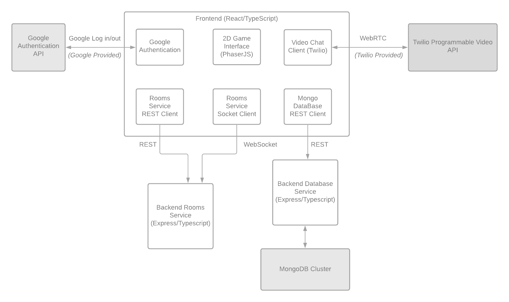

# Covey.Town

Covey.Town provides a virtual meeting space where different groups of people can have simultaneous video calls, allowing participants to drift between different conversations, just like in real life.
Covey.Town was built for Northeastern's [Spring 2021 software engineering course](https://neu-se.github.io/CS4530-CS5500-Spring-2021/), and is designed to be reused across semesters.
You can view our deployment of the app [here](https://gallant-elion-6ff0a6.netlify.app/).
You can view our github repo [here](https://github.com/kristen-hyman/covey.town).

The figure above depicts the high-level architecture of Covey.Town.
The frontend client (in the `frontend` directory of this repository) uses the [PhaserJS Game Library](https://phaser.io) to create a 2D game interface, using tilemaps and sprites.
The frontend implements video chat using the [Twilio Programmable Video](https://www.twilio.com/docs/video) API, and that aspect of the interface relies heavily on [Twilio's React Starter App](https://github.com/twilio/twilio-video-app-react).

A backend service (in the `services/roomService` directory) implements the application logic: tracking which "towns" are available to be joined, and the state of each of those towns.

Another backend service (in the `services/databaseService` directory) implements the database client which manages connections and transactions with MongoDB and allows the entire application to have persistence. It allows the application to maintain user state such as their friend lists, if they are online and their location.

## Running this app locally

Running the application locally entails running the backend rooms service, the backend database service, and a frontend.

### Setting up the backend

#### Rooms Service

To run the backend, you will need a Twilio account. Twilio provides new accounts with $15 of credit, which is more than enough to get started.
To create an account and configure your local environment:

1. Go to [Twilio](https://www.twilio.com/) and create an account. You do not need to provide a credit card to create a trial account.
2. Create an API key and secret (select "API Keys" on the left under "Settings")
3. Create a `.env` file in the `services/roomService` directory, setting the values as follows:

| Config Value            | Description                               |
| ----------------------- | ----------------------------------------- |
| `TWILIO_ACCOUNT_SID`    | Visible on your twilio account dashboard. |
| `TWILIO_API_KEY_SID`    | The SID of the new API key you created.   |
| `TWILIO_API_KEY_SECRET` | The secret for the API key you created.   |
| `TWILIO_API_AUTH_TOKEN` | Visible on your twilio account dashboard. |

### Starting the backend

#### Rooms Service

Once your backend is configured, you can start it by running `npm start` in the `services/roomService` directory (the first time you run it, you will also need to run `npm install`).
This backend service will automatically restart if you change any of the files in the `services/roomService/src` directory.

#### Database Service

You can start the database service by running `npm start` in the `services/databaseService` directory (the first time you run it, you will also need to run `npm install`).
This backend service will automatically restart if you change any of the files in the `services/databaseService/src` directory.

### Configuring the frontend

Create a `.env` file in the `frontend` directory, with the line: `REACT_APP_TOWNS_SERVICE_URL=http://localhost:8082/` (if you deploy the roomService to another location, put that location here instead)

Also add this line `REACT_APP_DATABASE_SERVICE_URL=http://localhost:8081/` (if you deploy the databaseService to another location, put that location here instead)

### Running the frontend

In the `frontend` directory, run `npm start` (again, you'll need to run `npm install` the very first time). After several moments (or minutes, depending on the speed of your machine), a browser will open with the frontend running locally.
The frontend will automatically re-compile and reload in your browser if you change any files in the `frontend/src` directory.

### Deploying this app to Heroku and Netlify
For deployment to Heroku and Netlify, utilize the steps outlined in the [following activity](https://neu-se.github.io/CS4530-CS5500-Spring-2021/Activities/continuous-development) and integrate the additional steps included below:

## Additional Steps (to integrate with the activity linked above)

## Set Up Github Actions
- Follow all steps in the activity linked above.
- In step 2, in the `.github/workflows/main.yml` file, add additional steps to the build-and-test section. The fully updated build-and-test section in the main.yml file is shown below:

## Set Up Heroku
- Follow all steps in the activity linked above.
- After completing this section, use the same steps to create a second Heroku app. Name the second app ‘covey-town-database’.
- Return to the GitHub Settings -> Secrets pane and add a new secret HEROKU_APP_NAME_DB and set to the name to ‘covey-town-database’.
- In the `.github/workflows/main.yml` file, add additional steps to the deploy section for the scond Heroku app. The fully updated deploy section in the main.yml file is shown below:

## Set Up Netlify
- Follow all steps in the activity linked above. 
- In Step 4, within the ‘Environment’ section of the settings page, add in the REACT_APP_DATABASE_SERVICE_URL, which is the Heroku server name for the second Heroku app that was created.

